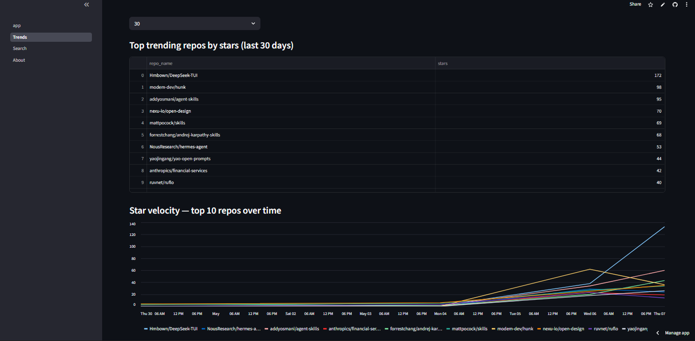
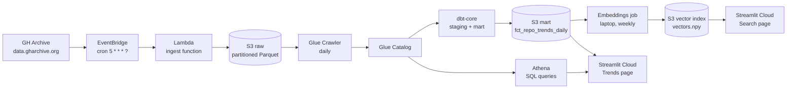

# Open Source Trends Intelligence Platform

A serverless data platform on AWS that ingests every public GitHub event, models trends with dbt-core on a Glue + Athena lakehouse, and adds semantic search over trending repositories using sentence-transformers and a numpy vector index. Built end-to-end as a portfolio project demonstrating modern data engineering practices: hourly ingestion via Lambda + EventBridge, partitioned Parquet on S3, version-controlled SQL transformations with dbt, automated cost guardrails, and a public Streamlit demo. Total monthly operating cost: under $2.

## Live demo

**App:** [ghtrends.streamlit.app](https://ghtrends.streamlit.app/)

**dbt project documentation:** [abiralpokhrel-learns.github.io/ghtrends](https://abiralpokhrel-learns.github.io/ghtrends/)

> Note on cold start: the app sleeps after 30 minutes of inactivity. First request after sleep takes 30-60 seconds to wake up.

## Screenshot



## Architecture



The flow in plain English:

- Every hour, EventBridge fires a Lambda function
- The Lambda downloads one hour of public GitHub events, filters to stars and pull requests, and writes Parquet to S3
- A Glue Crawler runs daily, registering new partitions in the Glue Catalog so Athena can query them
- dbt-core runs nightly, transforming the raw events into a `fct_repo_trends_daily` mart
- A weekly batch job picks the top 500 trending repos, embeds their descriptions with sentence-transformers, and uploads a numpy vector index to S3
- Streamlit Cloud reads from Athena (for trends) and from the S3 vector index (for semantic search)

## Tech stack

| Layer | Tool | Why |
|---|---|---|
| Ingestion | AWS Lambda + EventBridge | Pay-per-invocation, no server to maintain |
| Lake storage | Amazon S3, partitioned Parquet | Cheap, query-friendly, 5 GB free for 12 months |
| Catalog | AWS Glue Crawler + Glue Catalog | Auto-discovers new partitions, free tier covers it |
| Query engine | Amazon Athena | Serverless SQL on S3, pay per byte scanned |
| Transformation | dbt-core (Athena adapter) | Version-controlled SQL, dependency graph, testing |
| Embeddings | sentence-transformers (all-MiniLM-L6-v2) | Small (90 MB), fast, runs on a laptop CPU |
| Vector search | numpy in-memory cosine similarity | Sub-millisecond on 500 vectors. Faster than pgvector at this scale and zero infra |
| Vector storage | numpy + parquet on S3 | Streamlit Cloud loads the index at startup |
| UI | Streamlit on Streamlit Community Cloud | Free hosting, auto-deploy from GitHub |
| IaC | Terraform | 100% of infrastructure declared in code |
| State backend | S3 + DynamoDB | Standard production pattern for Terraform state |

## Design notes

A few choices that may surprise people:

- **No vector database.** For ~500 vectors at 384 dims, numpy's in-memory dot product is faster than pgvector and has zero infrastructure to maintain. The break-even point for a vector database is ~100K vectors; we're well below that.
- **No Iceberg.** Plain Parquet partitioned by date is enough for append-only event data. Iceberg's killer features (time travel, schema evolution, ACID) are not needed here. Captured in `NEXT.md` as a v2 idea.
- **No EC2.** Streamlit Community Cloud handles hosting for free. Embeddings are computed once a week on a laptop and pushed to S3. There is no always-on compute in this project.
- **No Step Functions.** EventBridge → Lambda direct invocation handles hourly batch ingest reliably. Step Functions would add complexity without proportional reliability gain at this scale.
- **No GitHub Actions for dbt yet.** dbt runs are manual for v1 (one command). OIDC + Actions cron is a v2 task. The dbt code is identical regardless of how it's scheduled.

The full reasoning for each cut is in `NEXT.md`.

## Findings

Five real findings produced by the queries in `analysis/queries/`:

### 1. Top trending repo: Hmbown/DeepSeek-TUI with 172 stars over 3 days


The top trending repository in the data window was Hmbown/DeepSeek-TUI, a terminal interface for DeepSeek, with 172 stars in 3 active days. The runners-up — modem-dev/hunk (98), addyosmani/agent-skills (95), nexu-io/open-design (70) — show a clear cluster around AI-developer-tooling, which tracks with the broader 2026 open-source momentum.

Query: [`analysis/queries/01_top_starred_repos.sql`](analysis/queries/01_top_starred_repos.sql)

### 2. Star velocity ranks the fastest-accelerating repo at 57 stars/day average


Velocity (avg daily stars) separates steady growth from viral spikes. Hmbown/DeepSeek-TUI averaged 57.3 stars/day with a single-day peak of 133 — a clear viral burst rather than slow-burn growth. Compare to addyosmani/agent-skills at 31.7 stars/day across 3 days — also strong, but more even. Useful for spotting what's hot right now, not what was popular six months ago.

Query: [`analysis/queries/02_star_velocity.sql`](analysis/queries/02_star_velocity.sql)

### 3. Bots dominate GitHub activity — Dependabot alone touched 7,079 unique repos


The top 5 most active GitHub accounts in the window are all bots: Dependabot (14,684 events across 7,079 repos), pull[bot] (4,631 events), github-actions[bot] (2,127), renovate[bot] (1,574), and Copilot (863). This is a measurement of what "open source contribution" actually looks like at scale — automated dependency updates and CI runs vastly outnumber human commits. The first non-bot account (gaoypChina) appears at rank 12 with 90 events.

Query: [`analysis/queries/05_active_users.sql`](analysis/queries/05_active_users.sql)

### 4. Hourly star distribution is bimodal across UTC


Star activity per UTC hour shows two peaks: 00:00 UTC (2,410 stars) and the late-evening UTC window from 22:00 to 23:00 (1,241 to 1,896 stars). The 13:00 to 18:00 UTC range is consistently quieter (~250-400 stars/hour). The pattern reflects how open-source engagement clusters around evenings in the Americas and mornings/evenings in Asia. Useful for timing launch announcements.

Query: [`analysis/queries/06_hourly_star_distribution.sql`](analysis/queries/06_hourly_star_distribution.sql)

### 5. Top organizations: Microsoft spreads wide, single-repo orgs go deep


Microsoft tops the org leaderboard with 332 events across 118 unique repos — the classic broad-and-shallow pattern of a large institutional contributor. Hmbown is the opposite: 194 events but only 1 unique repo. Different shapes of open-source presence: Microsoft is everywhere, Hmbown is everywhere on one project. Both visible in the same data window.

Query: [`analysis/queries/04_top_organizations.sql`](analysis/queries/04_top_organizations.sql)

## Cost breakdown

Designed to stay within the AWS free tier. Real spend during development:

| Service | Free tier (months 1-12) | After free tier (month 13+) |
|---|---|---|
| S3 storage | $0 (under 5 GB) | ~$0.10 |
| Lambda invocations | $0 (under 1M/month) | $0 |
| Athena scans | $0.50 (with 1 GB/query cap) | $0.50 |
| Glue Crawler | $0 (under 1M DPU-hours) | $0 |
| EventBridge | $0 | $0 |
| Streamlit Community Cloud | $0 (free forever for public apps) | $0 |
| **Total** | **$0-1/month** | **~$1-2/month** |

## Local setup

Reproduces the dev environment if you want to run any of this yourself. Commands assume bash or Git Bash. On PowerShell replace `source venv/Scripts/activate` with `venv\Scripts\activate`.

```bash
# Clone
git clone https://github.com/abiralpokhrel-learns/ghtrends.git
cd ghtrends

# One-time: create the Terraform state backend (S3 bucket + DynamoDB lock table)
make bootstrap

# Edit terraform/backend.tf with the bucket name printed by bootstrap
# Add TFSTATE_BUCKET=<name> to .env

# Provision the infra
make tf-init
make tf-apply

# Build the ingest Lambda zip (requires Docker running)
make lambda-package

# Run the Glue Crawler once to register tables
aws glue start-crawler --name ghtrends-dev-crawler --profile ghtrends

# Run the dbt models
cd dbt
dbt deps
dbt build
cd ..

# Build the embeddings index for the top 500 trending repos
cd embeddings
python -m venv venv
source venv/Scripts/activate
pip install -r requirements.txt
python embed_repos.py --top 500
cd ..

# Run Streamlit locally
cd streamlit
python -m venv venv
source venv/Scripts/activate
pip install -r requirements.txt
streamlit run app.py
```

Required local tools: Python 3.11+, Terraform 1.6+, AWS CLI v2, Docker (for Lambda packaging), Git, Make.

You will need an AWS account, a GitHub Personal Access Token (no scopes needed), and a few hours of patience for first-time setup. Total infra cost under $2/month.

## Project structure

```
ghtrends/
├── PHASES.md                    # Detailed 6-phase build plan
├── NEXT.md                      # v2 ideas (cut from v1)
├── README.md                    # This file
├── Makefile                     # Common commands
├── bootstrap/                   # One-time scripts (state backend)
├── terraform/                   # All infra as code
│   └── modules/
│       ├── s3_data_lake/        # Two S3 buckets
│       ├── lambda_ingest/       # Lambda + EventBridge
│       ├── glue_catalog/        # Glue Catalog + Crawler
│       └── streamlit_reader/    # Read-only IAM user for Streamlit Cloud
├── lambda/
│   └── ingest_gh_archive/       # Hourly ingest function
├── dbt/
│   └── models/
│       ├── staging/             # Clean column types
│       ├── intermediate/        # Daily aggregates
│       └── marts/               # fct_repo_trends_daily
├── embeddings/                  # Offline numpy vector index builder
├── streamlit/                   # Dashboard + semantic search
│   └── pages/
├── analysis/queries/            # Raw Athena SQL for ad-hoc analysis
└── docs/                        # Findings, screenshots, diagrams
```

## What this project is NOT

- Not a real-time streaming pipeline. GitHub Archive is hourly batch.
- Not a managed lakehouse with Iceberg. Plain Parquet, by design.
- Not a recommendation engine. The vector search is for finding similar repos by description, nothing more.
- Not enterprise-grade. The IAM is admin-level for the build user. v2 would tighten this.

Constraints I held to: every component is in the AWS free tier (or free forever), the architecture is reproducible from a clean AWS account in under a day, and every choice is defensible in an interview.

## Built by

Abiral Pokhrel — [GitHub](https://github.com/abiralpokhrel-learns) • [LinkedIn](https://www.linkedin.com/in/abiralpokhrel2005/)

Reach out if you'd like to talk about data engineering, AWS, or this project specifically.

## License

MIT — see [LICENSE](LICENSE) file.
